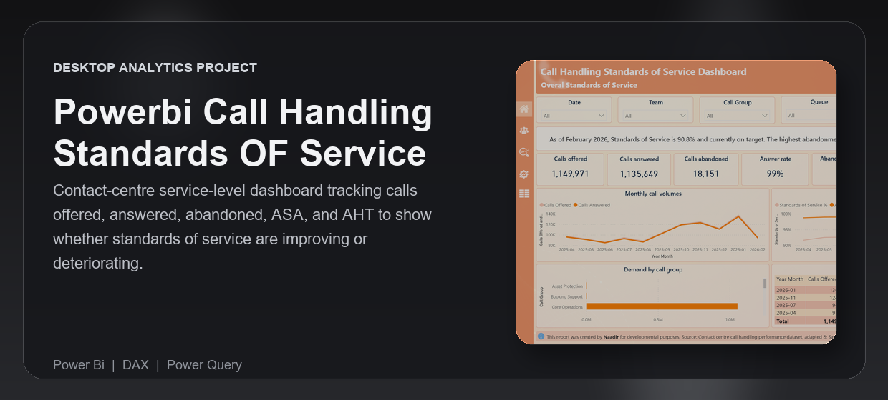
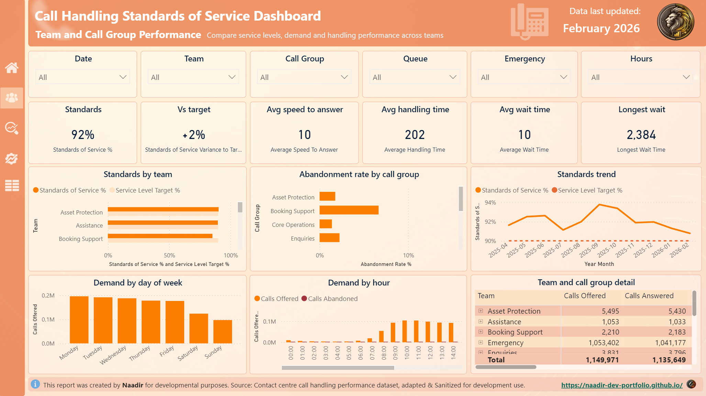
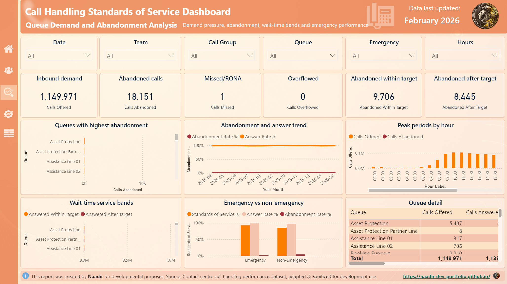
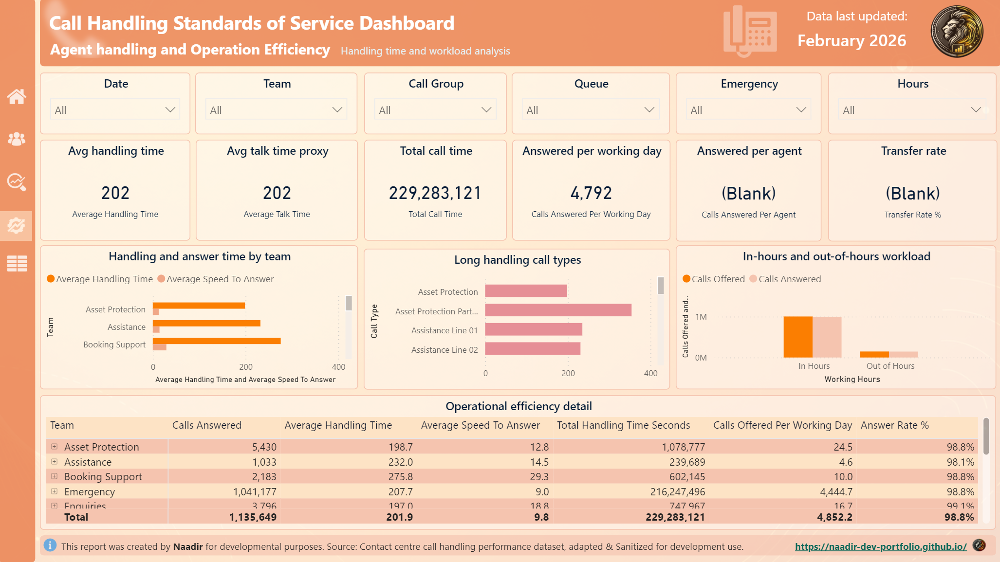

---
<div align="center">


<br /><br />

<p><strong>Contact-centre service-level dashboard tracking calls offered, answered, abandoned, ASA, and AHT to show whether standards of service are improving or deteriorating.</strong></p>

<p>Built for operations and service managers who need a clear view of demand, answer performance, abandonment pressure, and service-level risk.</p>

<p><strong>Technical documentation:</strong> <a href="https://naadir-dev-portfolio.github.io/powerbi-call-handling-standards-of-service-dashboard/">View the published report documentation</a></p>

<p>
  <a href="#overview">Overview</a> |
  <a href="#what-problem-it-solves">What It Solves</a> |
  <a href="#feature-highlights">Features</a> |
  <a href="#screenshots">Screenshots</a> |
  <a href="#quick-start">Quick Start</a> |
  <a href="#tech-stack">Tech Stack</a>
</p>

<h3><strong>Made by Naadir | May 2026</strong></h3>

</div>

---

## Overview

This Power BI PBIP project turns raw telephony extracts into a model-ready standards of service dashboard. It profiles call demand, answer performance, abandonment, wait times, handling time, emergency classification, working-hours pressure, and mapped service-line performance from the supplied data files.

## What Problem It Solves

- Give management and overview and insight over telephony performance to make data driven decisions
- Removes scattered manual checks across telephony extracts and mapping files
- Replaces ad hoc spreadsheet summaries with a reusable Power BI semantic model
- Makes service-level deterioration, abandonment pressure, and peak demand periods easier to see
- Gives a cleaner default than a raw extract by adding dimensions, measures, relationships, and report pages

### At a glance

| Track | Analyse | Compare |
|---|---|---|
| Calls offered, answered, abandoned, missed, overflowed, ASA, wait time, and AHT | Standards of Service %, answer rate %, abandonment rate %, emergency performance, and working-hours pressure | Teams, call groups, queues, call types, emergency vs non-emergency, and in-hours vs out-of-hours |
| Raw telephony extract and call-type mapping table | Curated star-schema tables, Calendar relationship, emergency classification, and reusable DAX measures | Current performance against a configurable 90% service-level target |
| PBIP refresh workflow and curated CSV outputs | KPI cards, trend charts, matrix views, and detailed aggregate records | Demand, wait-time, abandonment, and handling-time trade-offs across service lines |

## Feature Highlights

- **Standards of service model**, calculates weighted service level from service-level calls and service-level calls offered
- **Call demand analysis**, tracks offered, answered, abandoned, missed, overflowed, and short-call volume from the available fields
- **Mapped operational dimensions**, turns raw call types into team, call group, queue, function, and emergency classification views
- **Calendar and time analysis**, supports month, week, day-of-week, hour, half-hour, and working-hours pressure analysis
- **Handling and wait metrics**, adds ASA, average wait time, longest wait time, average handling time, and total call time measures
- **Documented source limits**, keeps unavailable agent, transfer, hold, ACW, logged-in-time, and repeat-call KPIs visible as intentional blanks

### Core capabilities

| Area | What it gives you |
|---|---|
| **Executive service view** | KPI cards and monthly trends for demand, answer rate, abandonment rate, and Standards of Service % |
| **Team and call group performance** | Side-by-side comparison of mapped teams, call groups, queues, and call types |
| **Queue pressure analysis** | Views for peak demand, abandonment concentration, wait-time bands, and emergency call performance |
| **Repeatable PBIP build** | A scripted path from raw Excel files to curated data, TMDL semantic model, DAX measures, and report pages |

## Screenshots

<details>
<summary><strong>Open screenshot gallery</strong></summary>

<br />

<div align="center">
  
  <br /><br />
  
  <br /><br />
  
</div>

</details>

## Quick Start

```bash
# Clone the repo
git clone https://github.com/Naadir-Dev-Portfolio/powerbi-call-handling-standards-of-service-dashboard.git
cd powerbi-call-handling-standards-of-service-dashboard

# Install dependencies
python -m pip install pandas openpyxl

# Run
python scripts/build_powerbi_project.py
```

Open `Call Handling Standards of Service Dashboard.pbip` in Power BI Desktop and refresh the model. No API keys are required; the project uses the local files in `Source Data/raw`.

## Tech Stack

<details>
<summary><strong>Open tech stack</strong></summary>

<br />

| Category | Tools |
|---|---|
| **Primary stack** | `DAX`, `Power Query`, `PBIP`, `TMDL` |
| **UI / App layer** | Power BI Desktop report pages and PBIR visual definitions |
| **Data / Storage** | Excel source files, curated CSV files, local PBIP project files |
| **Automation / Integration** | Python build script for profiling, transformation, semantic model generation, and report setup |
| **Platform** | Windows with Power BI Desktop |

</details>

## Architecture & Data

<details>
<summary><strong>Open architecture and data details</strong></summary>

<br />

### Application model

The project starts with the raw telephony extract and call-type mapping workbook in `Source Data/raw`. The build script reads those files, excludes undated summary rows from the modelled fact table, applies mapping fields, derives emergency and working-hours classifications, and writes curated CSV tables.

Power BI then imports the curated tables through the generated TMDL model. The model relates `Fact Telephony` to Calendar, time slot, call type, team, call group, queue, function, emergency classification, and working-hours dimensions. Report pages use DAX measures for service level, answer rate, abandonment, wait time, handling time, workload, and source-limitation placeholders.

### Project structure

```text
powerbi-call-handling-standards-of-service-dashboard/
+-- Call Handling Standards of Service Dashboard.pbip
+-- Call Handling Standards of Service Dashboard.Report/
+-- Call Handling Standards of Service Dashboard.SemanticModel/
+-- Curated Data/
+-- Source Data/
+-- scripts/
+-- MODEL_NOTES.md
+-- README.md
+-- repo-card.png
+-- portfolio/
    +-- powerbi-call-handling-sos.json
    +-- powerbi-call-handling-sos.webp
    +-- Screen1.png
    +-- Screen2.png
    +-- Screen3.png
```

### Data / system notes

- The model uses only the supplied local Excel files and generated curated CSV files
- The source grain is date, half-hour, and call type

</details>

## Contact

Questions, feedback, or collaboration: `naadir.dev.mail@gmail.com`

<sub>DAX | Power Query</sub>
